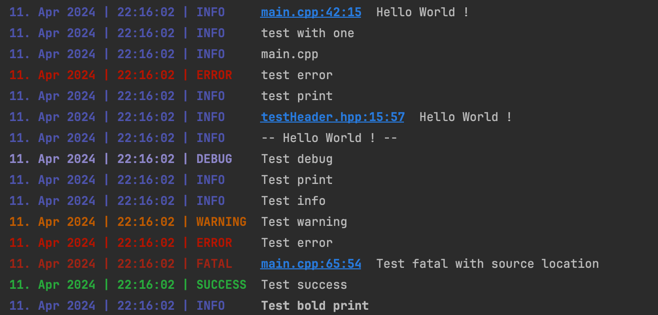

# Environment Log

## Example Output



## Features

| Feature                  | Description                                                                     | Implemented |
|--------------------------|---------------------------------------------------------------------------------| :---------: |
| **Log Level**            | Displayed only the log entries that you want.                                   |   ✅        |
| **Colorized***           | Displayed the log entry head with color.                                        |  ✅       |
| **Timestamp**            | Displayed the log entry timestamp.                                              |  ✅       |
| **String Interpolation** | Support string interpolation.<br/> like this --> ("This is ${0}.", "a message") |  ✅       |
| **Log File**             | Write the log entries to the file.                                              |  ❌       |
| **Log Pool****           | A pool for the log stream's where you can get you log from every location       |  ✅       |
| **Source Location***     | Displayed the log entry source location.                                        |  ✅       |

> *: Toggleable<br/>
> **: Raw implementetion

## Environment Configuration

By default the `EnvironmentLog` get a predefined environment configuration, if you want to change it you can do it by the following way:

```c++
    // nothing to change
    // auto log = EnvironmentLog();
    
    // change the log path, level & colorize
    auto log = EnvironmentLog({
        .logDirectory = "./project/logs",
        .dateFormat = "%d. %b %Y",
        .timeFormat = "%T",
        .displayedLogLevel = LogLevel::DEBUG,
        .colorize = false,
        .stream = std::cout
    });
```

## Usage

```c++
    // log a message
    log.print("Hello World!");

    // log a message with string interpolation
    log.print("Hello ${0}!", "World");

    // log a message with string interpolation and source location
    log.print("Hello ${0} ${1}",
                {"World", "!"},
                std::source_location::current());
```

## Log Level

```c++
    // log a message
    log.print("Print");
    log.debug("Debug");
    log.info("Info"); // same as print
    log.warning("Warning");
    log.error("Error");
    log.fatal("Fatal");
```
